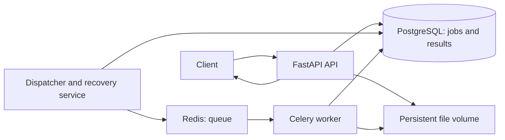

# Phase 1: Design and Scope

Status: initial design baseline. Phase 2 implementation and verification are tracked in `02-ingestion.md`.

## Objective

Build a service that accepts documents, extracts their text in the background, and lets users retrieve progress and results. Deliverables include code that runs with a single Docker Compose command and a PDF report with architecture diagrams, product information, and technical decision justifications.

## Initial Scope

- Support PDF, PNG, JPG/JPEG, and TXT. The assignment says "PGN/JPG"; PNG is interpreted as the intended image format.
- Initial configurable limit: 20 MiB per file. For PDFs, propose a maximum of 100 pages, checked during processing.
- Accept UTF-8 TXT files; return a clear error if decoding fails.
- Initially support Spanish and English OCR. Optional `ocr_language` parameter: `spa`, `eng`, or `spa+eng`.
- Extract text and basic metadata: original filename, size, detected type, timestamps, processing duration, extraction method, and page count where applicable.
- Provide an API for uploading documents and retrieving jobs and results.
- Leave the user interface, Flower, and monitoring dashboard for an optional phase.
- These limits are project proposals, not values required by the assignment.

## Proposed Architecture

| Component | Responsibility and rationale |
|---|---|
| FastAPI | Accept uploads and expose HTTP queries; separate ingestion from extraction. |
| PostgreSQL | Persist job states, attempts, errors, results, and work awaiting dispatch. |
| Redis + Celery | Distribute tasks to workers; this is the assignment's recommended option. |
| Shared volume | Preserve original documents and let the API and workers access the same files in the local deployment. |
| Dispatcher and recovery service | Enqueue pending jobs and detect stalled processing. |

Claim-check pattern: queue messages contain only a job identifier. The worker retrieves the file location from the database; document bytes do not pass through Redis.

## Workflow and Consistency

1. The API validates file size and actual type without relying solely on the extension or declared MIME type.
2. It stores the file under a server-generated identifier rather than using the original filename as a path.
3. It creates the job and a pending dispatch entry in the same database transaction.
4. It returns HTTP 202 with the identifier and status URL once the file and record are persisted.
5. The dispatcher publishes the identifier to Redis. Duplicate messages are possible, so workers must be idempotent.
6. The worker claims the job atomically, extracts its content, and saves the result and final state consistently.
7. The client retrieves status and results through the API.

File writes and database transactions are not atomic together. Invalid or incomplete uploads are cleaned up where possible. If database commit confirmation fails, retain the file because the transaction may have committed despite a connection failure. Subsequent reconciliation will identify orphaned files after a grace period. An upload is never acknowledged unless its file has been persisted.

## States and Recovery

Public states: `queued`, `processing`, `retrying`, `succeeded`, `failed`.

- `succeeded` and `failed` are terminal states.
- Permanent errors, such as corrupted or protected files that cannot be processed, lead to `failed` with an understandable code and message.
- Transient errors initially allow up to 3 total attempts with increasing delays.
- Each execution has a configurable time limit, initially 10 minutes, and a processing lease recorded in PostgreSQL.
- The recovery service checks pending jobs and expired leases, then redispatches jobs or marks them as failed if attempts are exhausted.
- An old execution cannot overwrite a newer execution's result: updates must check the active attempt identifier.
- Pending work can be reconstructed from PostgreSQL if Redis contents are lost.
- Recovery assumes services become available again and persistent volumes are preserved. Processing cannot advance while the entire stack is stopped.

Status queries report the current state and stage rather than an invented completion percentage. Page-level progress may be added if the extractor supports it.

## Initial API Contract

| Method and route | Behavior |
|---|---|
| `POST /documents` | Accepts multipart `file` and optional `ocr_language`. Returns 202 with `job_id`, `status`, and `status_url`. |
| `GET /jobs/{job_id}` | Returns state, stage, attempts, timestamps, and any public error. Returns 404 for an unknown ID. |
| `GET /jobs/{job_id}/result` | Returns text and metadata as JSON on success. Returns 409 if the job is unfinished or failed, and 404 if it does not exist. |
| `GET /health` | Reports API availability; dependency checks will be defined during implementation. |

Upload errors: 413 for excessive size, 415 for unsupported formats, and 422 for invalid parameters. Errors discovered after accepting a job are reported through its status.

## Minimum Data Model

`jobs` table: identifier, original filename, storage location, detected type, size, OCR language, state, stage, active attempt, attempt count, lease expiration, next execution time, timestamps, and public error.

`job_results` table: job identifier, extracted text, and metadata. One result per job.

`job_dispatches` table: work awaiting publication, availability time, and dispatch state. Concurrency details will be defined during implementation.

Original files remain in the volume, while extracted text is stored in PostgreSQL. This separation allows result retrieval without rereading files. Automatic document deletion is outside the initial scope.

## Extractor Comparison

Before selecting the final libraries, prepare small samples of digital, scanned, and mixed PDFs, plus images, with manually reviewed expected text. TXT files will use direct reading.

Compare local, open-source candidates, such as pypdf and PyMuPDF for digital PDFs, and Tesseract and another local OCR option. Review licenses and dependencies before deciding. Measure runtime, accuracy against expected text, memory usage where feasible, and installation complexity. Record hardware, versions, and samples to make the comparison reproducible.

Phase 3 is now complete. See `03-extraction-benchmark.md` for measured results and the choice of pypdf, PDFium, and Tesseract. The paragraphs above record the original comparison plan.

## Phases and Acceptance Criteria

1. **Design:** document scope, architecture, API, and recovery. Deliverable: this file.
2. **Ingestion and persistence:** accept supported files, reject invalid uploads, and durably store files and jobs. Return a queryable ID.
3. **Extractor comparison:** document samples, measurements, and the technical decision.
4. **End-to-end processing:** start with TXT, then add PDFs and images. Retrieve text and metadata through the API.
5. **Recovery:** test interruptions, duplicates, and exhausted retries. No accepted job is abandoned after services are restored.
6. **Integration:** provide Docker Compose, a README, and acceptance tests from a clean environment.
7. **Report:** produce a PDF covering the final architecture, product, benchmark, decisions, tests, and limitations.

## Planned Acceptance Tests

- Valid TXT files, digital PDFs, scanned PDFs, and images produce retrievable text.
- Unsupported formats and oversized uploads are rejected with clear messages.
- Corrupted files reach a terminal state with an understandable error.
- Mixed PDFs exercise the page-level extraction strategy.
- Killing and restarting a worker during extraction allows the job to recover.
- Restarting the stack with pending jobs preserves their records and allows completion.
- Dispatching the same job twice does not produce conflicting results.
- Simulating an interruption between registration and publication does not lose the job.
- Exhausting attempts produces a terminal state and a useful error.

## Phase Completion

Phases 1–6 are implemented. See `02-ingestion.md` for ingestion checks, `03-extraction-benchmark.md` for the selected extractors, `04-processing.md` for the extraction pipeline, `05-recovery.md` for bounded retries and interruption recovery, and `06-integration.md` for clean-state acceptance. The final report remains phase 7.
