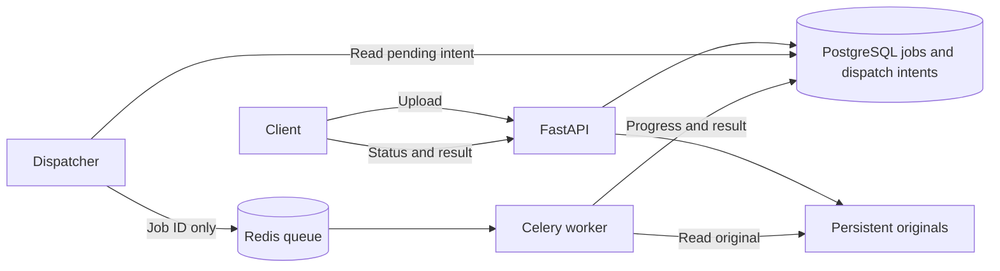

# Phase 4: Asynchronous Extraction Pipeline

Historical phase 4 record. Recovery limitations below are addressed in [phase 5](05-recovery.md).

Status: implemented and verified. The running API is available at http://localhost:8001/docs in this workspace.

## Implemented Behavior

The API accepts a document, saves its original bytes, and commits a job plus dispatch intent. A dispatcher publishes the job ID to Redis. Celery workers atomically claim queued jobs, extract text, report progress, and persist the result in PostgreSQL. Clients retrieve results through `GET /jobs/{job_id}/result`.

The worker supports:

- UTF-8 TXT through direct reading.
- Digital PDFs through pypdf.
- Scanned PDF pages through PDFium rendering and Tesseract.
- Mixed PDFs using page-level native-text/OCR selection.
- PNG and JPG/JPEG through Tesseract, with EXIF orientation correction.
- `ocr_mode=always` for explicit full-page OCR even when native text exists.

Results contain text and metadata: original filename, hash, size, type, page count, per-page method and character count, OCR language/mode/DPI, duration, warnings, and engine versions. Blank/unreadable pages produce warnings. TXT has no physical page count.

## Database Upgrade

Alembic revision `0001` creates or adopts the existing phase 2 job/dispatch tables after checking required columns. Revision `0002` adds `jobs.ocr_mode`, defaulting to `auto`, and the `job_results` table. Existing records and files are preserved. The migration does not perform a full audit of arbitrary third-party database schemas.

Compose runs a dedicated migration service before starting the API, dispatcher, and worker. Applying the upgrade again is a no-op. The original phase 2 sample job was preserved and successfully processed by the new worker.

## Queue and Result Consistency

The dispatcher marks an intent as sent only after publication. Publication failure leaves it pending. A crash between publication and marking can produce duplicate messages; the worker's conditional `queued -> processing` update prevents a duplicate from concurrently claiming the same job. Completed jobs are ignored. Successful state and result are committed in one database transaction.

PostgreSQL is the authoritative source for job status and results. Celery task completion only describes execution of the task handler: a handled invalid document has a failed job record even though its Celery handler returns normally. Expected failures have public codes and messages without internal paths or tracebacks in the HTTP response.

The worker uses one-message prefetch per process, late acknowledgment, and rejection on worker loss, following the [Celery task configuration documentation](https://docs.celeryq.dev/en/stable/userguide/configuration.html). These settings do not replace database recovery; see the phase 5 limitations below.

## Verified Runtime

| Component | Version/configuration |
|---|---|
| Celery | 5.6.3, two worker processes |
| Redis | Redis 7.4 image, AOF enabled, fsync every second |
| PostgreSQL | PostgreSQL 17 image |
| pypdf | 6.19.0 |
| pypdfium2 | 5.13.0 |
| Pillow | 12.3.0 |
| Tesseract | Debian 5.3.0 (`tesseract-ocr` package 5.3.0-2) |
| Language data | `eng` and `spa`, Debian packages 1:4.1.0-2 |
| PDF limit | 100 pages |
| Decoded image limit | 40 million pixels |
| OCR | 180 DPI for PDF rendering, PSM 3, one OpenMP thread |
| Time limits | 90 seconds per OCR page; Celery soft/hard limits of 570/600 seconds |

The Dockerfile uses Debian Bookworm packages. Python application dependencies are pinned; the base image, Redis/PostgreSQL tags, OS dependencies, and transitive dependencies are not fully locked to immutable snapshots. Runtime metadata records the actual OCR version. The original Windows benchmark is not presented as an exact measurement of this Linux build.

## Verification Results

| Check | Outcome |
|---|---|
| Local tests | 39 application tests plus 5 benchmark metric tests passed (44 total). |
| PostgreSQL tests in Docker | All 39 application tests passed against the isolated test database. |
| Existing-data migration | Automated legacy-schema test passed; the original live phase 2 job and source hash were preserved. |
| End-to-end success cases | Seven passed: TXT, digital PDF, scanned Spanish PDF, mixed PDF, PNG, JPG receipt, and forced OCR on a digital PDF. |
| End-to-end expected failures | Three passed: corrupt PDF, corrupt PNG, password-protected PDF. Jobs reached `failed`; result requests returned 409. |
| Duplicate message handling | A completed job was not extracted again and retained exactly one result. |
| Publication failure | A simulated broker failure retained the pending intent and queued job. |
| Restart after completion | All ten job states and all seven successful result metadata records remained available after restarting API, database, worker, and dispatcher. |
| Worker availability | Celery inspection returned `pong` after restart. |
| Static checks | Ruff lint/format and dependency consistency checks passed. |

Two existing upstream deprecation warnings remain in the Starlette test client; no warnings are suppressed.

Reproduction commands are in the [README](../README.md). The real pipeline smoke script is [pipeline_smoke.py](../scripts/pipeline_smoke.py), with run-specific evidence at `tmp/phase4-e2e.json`. Test sample jobs remain in the application. The separate test database was stopped after verification.

## Phase 5 Work Still Required

This phase verifies the normal asynchronous flow and basic document failures. It does not establish the assignment's full crash-recovery guarantee.

- A process killed after claiming a job can leave it in `processing`; redelivery alone currently ignores that state. Add leases, attempt ownership, and reconciliation before claiming recovery from forced termination.
- Add bounded retries for transient infrastructure errors, distinguish retryable and permanent failures, and prevent stale attempts from overwriting newer results.
- Reconstruct queued/sent work if broker messages are lost. Redis AOF every second is not a no-loss guarantee.
- Reconcile orphaned files and partial uploads, including uncertain database commit outcomes.
- Test forced worker/stack termination, Redis loss, interrupted commits, timeout handling, and retry exhaustion.

Automatic mode also remains conservative: pages with both native text and scanned content may need `ocr_mode=always`. Arbitrary rotation correction, handwriting, complex layout reconstruction, and OCR accuracy guarantees are outside the current implementation.

Phase 4 is complete. The next phase is failure recovery and its fault-injection tests.
